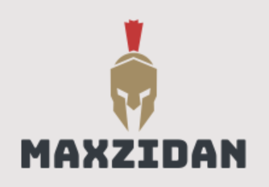
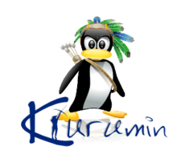

    
    <h2>
       Meu Readme
    </h2>
    Readme padrão para os meus repositórios

 

## Sobre o projeto

Facilitar o desenvolvimento de um readme, de maneira visual e que tenha todos os conteúdos necessários.

## Features
- [x] Hierarqui visual
- [x] Sintaxe markdown
- [x] Organização da documentação
- [x] Utilização das shields
- [ ] Contribuidores automáticos

## Começando

### **Prerequisitos**
- Ter o git instalado
- Extensão `Markdown All in One` no Vscode

### **Instalação**
1. Clonar o repositório `git clone`
2. Abrir o reame
3. Visualizar pela extensão 

## Como contribuir
- Issues [issue](https://github.com/maxzidan/meu-readme/issues)

- Depois de issue aceita, mandar um Pull Request (PR)

## Contribuidores
- Automática [Bot](https://github.com/all-contributors/all-contributors)

[Maxzidan](https://avatars.githubusercontent.com/u/14918031?v=4) |
| :----: |
| 

## Licença

[Licença MIT](LICENSE)

---

### Desenvolvido

